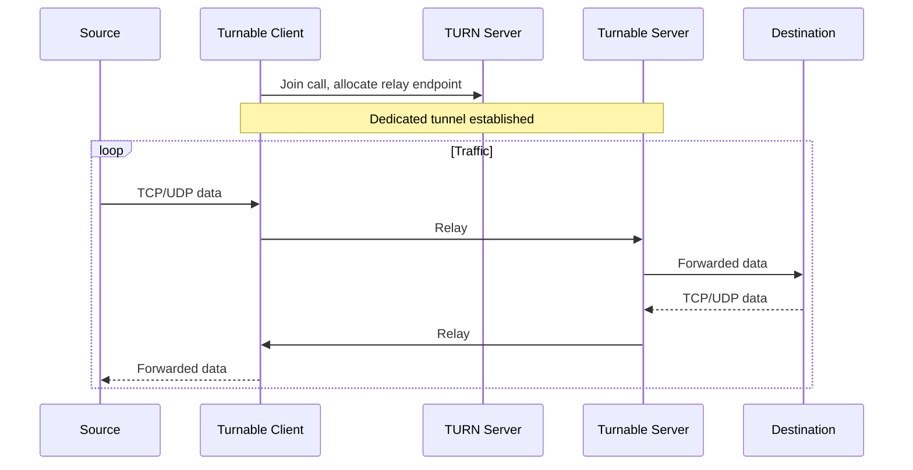
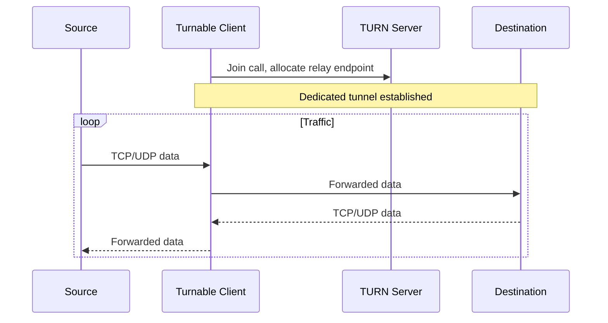
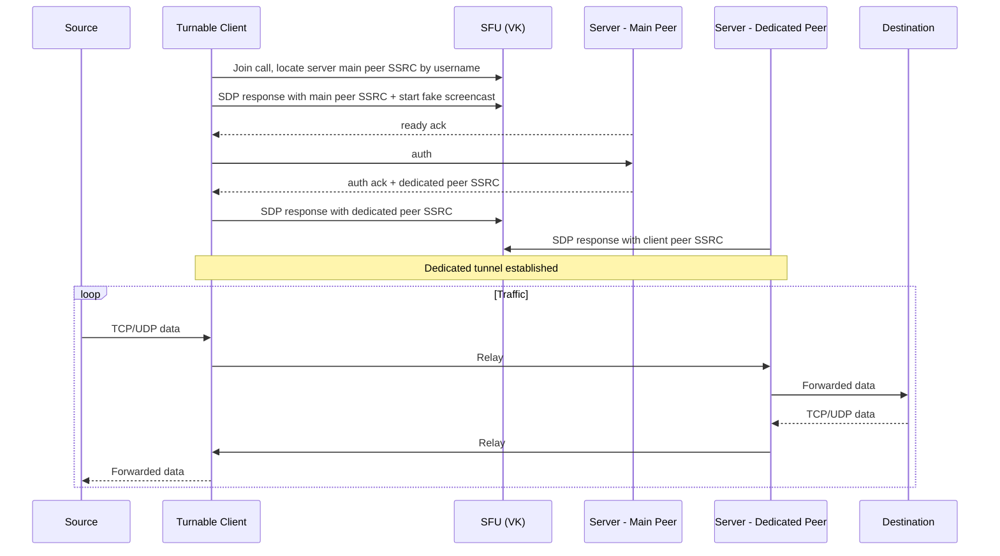

# Turnable &nbsp;·&nbsp; [🇷🇺 RU](NEW_README_RU.md)
Turnable is a VPN core that tunnels TCP/UDP traffic through [TURN](https://en.wikipedia.org/wiki/Traversal_Using_Relays_around_NAT) relay servers or via [SFU](https://bloggeek.me/webrtcglossary/sfu/) provided by platforms like VKontakte. Traffic mimics legitimate WebRTC media and is encrypted, multiplexed, and spread across multiple peer connections. The entire codebase is modular and can be freely extended to add new features or support more platforms.

---

## Features
1. Future-proof modular architecture
2. Full support for both TCP and UDP sockets
3. Tunneling through multiple peer connections to bypass ratelimits
4. Multiplexing to allow establishing multiple route connections
5. End-to-end encryption - forced for handshake, optional for data
6. Convenient user and route management with proper authentication
7. Overall more stable and less hacky implementation than others

---

## How it works
There are two methods of establishing a tunnel with a remote server that Turnable supports. Both of them allow to establish multiple TCP/UDP connections via multiplexing, with traffic being spread through multiple peer connections to bypass platform ratelimits.

<details>
<summary>Relay - tunnel via TURN with an intermediate</summary>

The client allocates a relay address on the platform's TURN server, connects to the Turnable server, and from there it forwards traffic to the configured destination. Simple and stable, but is usually heavily throttled and can be detected.


</details>

<details>
<summary>Direct Relay - direct tunnel via TURN</summary>

The client allocates a relay address on the platform's TURN server and connects to the destination server directly. Does not require a Turnable server. **⚠️ Not recommended and is dangerous to use.**



</details>

<details>
<summary>P2P - fake screencast via SFU ⚠️ WIP</summary>

The client and server communicate through the platform's SFU, disguising all traffic as a screencast stream.



</details>

---

## Building
Pre-built binaries are available on the [releases page](https://github.com/TheAirBlow/Turnable/releases). Pick the correct file for your OS and architecture.

If you would like to compile it yourself, run this command on the target machine:
```bash
go build -o turnable ./cmd
```

Check out the [ci.yml](https://github.com/TheAirBlow/Turnable/blob/main/.github/workflows/ci.yml) workflow for cross-compilation.

---

## Setup
**Quick start:** Follow the [client](docs/client/SETUP.md), [server](docs/server/SETUP.md) or [service](docs/service/SETUP.md) setup guide.
**Configuration:** Detailed reference for [client](docs/client/CONFIG.md) and [server](docs/server/CONFIG.md) config schemas.

> [!NOTE]
> If something broke after an update, most likely the configuration format has changed. You need to update it manually.

---

## Missing features
- Built-in WireGuard / SOCKS5 server and client
- Traffic obfuscation (cloak) implementations
- Database user and route management
- P2P connection type (via SFU)
- Android app

---

## Credits
- [vk-turn-proxy](https://github.com/cacggghp/vk-turn-proxy) - original project, on which Turnable is partially based on.

---

## License
[GNU General Public License v2.0](https://github.com/TheAirBlow/Turnable/blob/main/LICENCE)
