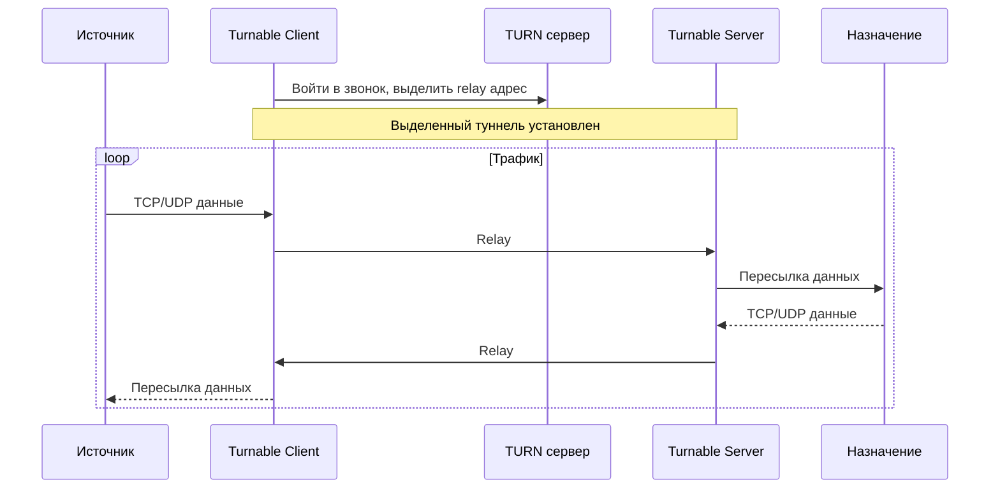
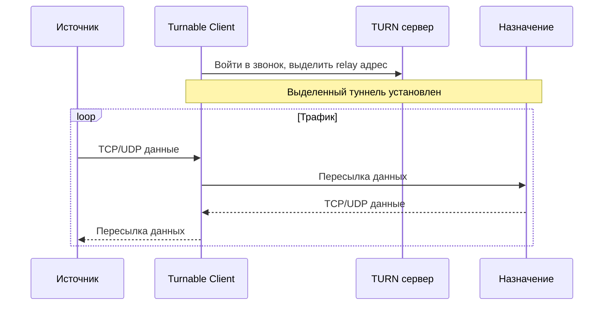
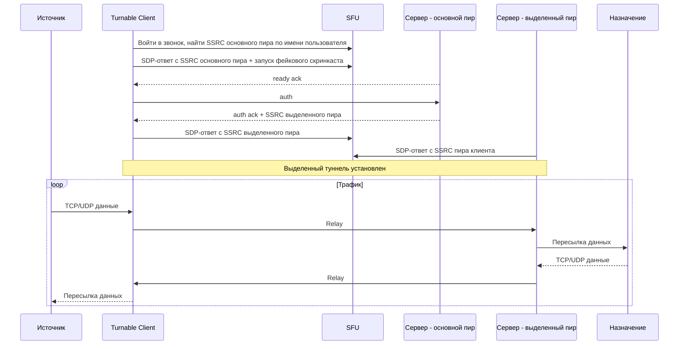

# Turnable &nbsp;·&nbsp; [🇺🇸 EN](NEW_README.md)
Turnable - это VPN ядро, которое туннелирует TCP/UDP трафик через [TURN](https://en.wikipedia.org/wiki/Traversal_Using_Relays_around_NAT) серверы или через [SFU](https://bloggeek.me/webrtcglossary/sfu/) платформ вроде ВКонтакте. Трафик имитирует легитимный WebRTC поток, шифруется, мультиплексируется и распределяется по нескольким peer соединениям. Весь код модульный и легко расширяется для добавления новых функций или поддержки новых платформ.

---

## Возможности
1. Перспективная модульная архитектура
2. Полная поддержка TCP и UDP сокетов
3. Туннелирование через несколько peer соединений для обхода ограничений по скорости
4. Мультиплексирование для установки нескольких конечных соединений
5. Сквозное шифрование - обязательное для рукопожатия, опциональное для данных
6. Удобное управление пользователями и маршрутами с аутентификацией
7. Более стабильная и менее костыльная реализация по сравнению с аналогами

---

## Как это работает
Существует два способа установить туннель с удалённым сервером. Оба позволяют создавать множество TCP/UDP соединений через мультиплексирование, при этом трафик распределяется по нескольким peer соединениям для обхода ограничений платформы.

<details>
<summary>Relay - туннель через TURN с промежуточным сервером</summary>

Клиент выделяет relay адрес на TURN сервере платформы, подключается к серверу Turnable, после чего он пересылает трафик к настроенному назначению. Просто и стабильно, но обычно сильно ограничивается по скорости и легко детектится.


</details>

<details>
<summary>Direct Relay - прямой туннель через TURN</summary>

Клиент выделяет relay адрес на TURN сервере платформы и напрямую подключается к настроенному назначению. Не требует сервера Turnable. **⚠️ Не рекомендуется и опасно к использованию.**



</details>

<details>
<summary>P2P - фейковый скринкаст через SFU ⚠️ WIP</summary>

Клиент и сервер общаются через SFU платформы, маскируя весь трафик под стрим скринкаста.



</details>

---

## Сборка
Готовые бинарники доступны на [странице релизов](https://github.com/TheAirBlow/Turnable/releases). Выбери нужный файл для своей ОС и архитектуры.

Для самостоятельной сборки выполни эту команду на целевой машине:
```bash
go build -o turnable ./cmd
```

Кросс-компиляция описана в workflow [ci.yml](https://github.com/TheAirBlow/Turnable/blob/main/.github/workflows/ci.yml).

---

## Настройка
**Быстрый старт:** Следуй гайду установки [клиента](docs/client/SETUP_RU.md), [сервера](docs/server/SETUP_RU.md) или [сервиса](docs/service/SETUP_RU.md).
**Конфигурация:** Подробная справка по конфигурации для [клиента](docs/client/CONFIG_RU.md) и [сервера](docs/server/CONFIG_RU.md).

> [!NOTE]
> Если что-то сломалось после обновления, скорее всего изменился формат конфигурации. Необходимо вручную её обновить.

---

## Нереализованные функции
- Встроенный WireGuard / SOCKS5 сервер и клиент
- Реализации маскировки трафика (cloak)
- Управление пользователями и маршрутами через базу данных
- P2P подключение через SFU
- Приложение для Android

---

## Респект
- [vk-turn-proxy](https://github.com/cacggghp/vk-turn-proxy) - оригинальный проект, на котором частично основан Turnable.

---

## Лицензия
[GNU General Public License v2.0](https://github.com/TheAirBlow/Turnable/blob/main/LICENCE)
